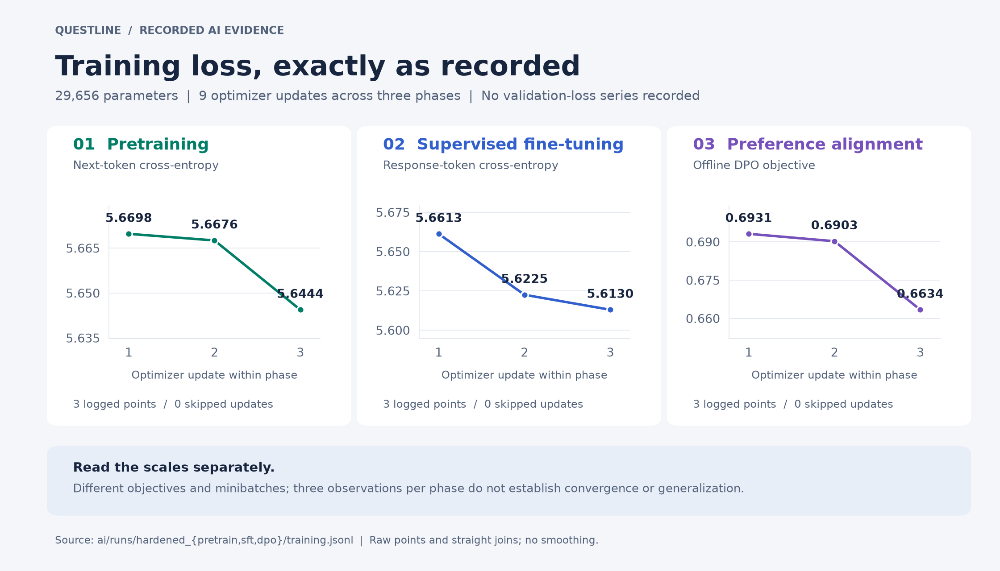
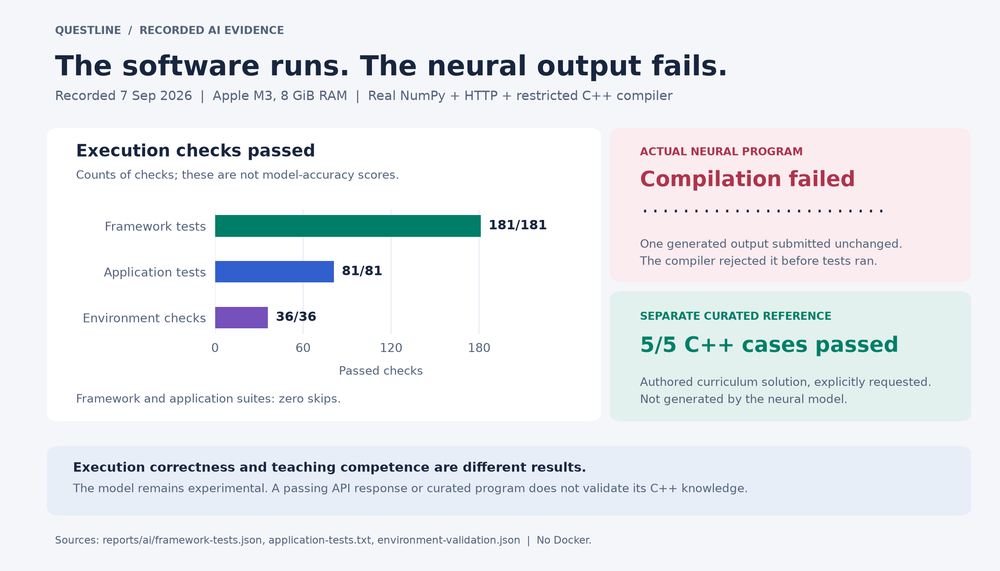

# Questline — your local C++ practice lab

A gamified learning workspace with an embedded C++ editor, real compilation and tests, a local study mentor, and persistent progress. It runs entirely on your Mac. No Docker, accounts, API keys, or paid services are required.

The repository now includes the complete NumPy research framework, actual trained weights, tokenizer, training fixtures, and AI environment verification. The neural checkpoint has **29,656 parameters** and **fails its C++ quality gate**. Use the grounded study guide for practice; the neural option is a small training and inference experiment.

## Training and test result images

These charts are rendered directly from the committed training logs and test reports. They show the existing recorded runs; no new training or benchmark run is implied. [Full-resolution PNGs, vector SVGs, source hashes, and regeneration instructions](reports/ai/figures/README.md) are included.






## Actual AI and environment test results

Verified locally on **7 September 2026**, using Apple M3, 8 GiB memory, macOS arm64, CPython 3.14.6, NumPy 2.4.6, and Apple Clang 21.0.0. Tests use temporary databases and real restricted compiler processes.

| Check | Measured result | Evidence |
| --- | --- | --- |
| Tensor, gradient, model, training, checkpoint, and distributed framework tests | **181 passed**, zero skips | [Log](reports/ai/framework-tests.txt), [machine report](reports/ai/framework-tests.json) |
| Dashboard, mentor, runner, persistence, API, and bundled-checkpoint tests | **81 passed**, zero skips | [Full test log](reports/ai/application-tests.txt) |
| Actual model → HTTP API → restricted C++ environment journey | **36 execution checks passed** in 8.526 seconds | [Readable report](reports/ai/environment-validation.md), [JSON with outputs and source hashes](reports/ai/environment-validation.json) |
| Neural C++ output compiled unchanged | **Failed compilation**; the model returned 24 dots for the program request | [Actual prompts, output, and compiler result](reports/ai/environment-validation.md#observed-neural-outputs) |
| Explicitly requested curated reference solution | **5/5 C++ cases passed**, with three hidden result payloads redacted | [Environment report](reports/ai/environment-validation.md) |
| Held-out C++ paired-answer quality screen | **FAILED**: correct answer preferred on **7/18 (38.9%)** using mean token likelihood and **6/18 (33.3%)** using summed likelihood | [Complete quality report](reports/ai/cpp-quality.json), [model card](ai/MODEL_CARD.md) |

The quality gate requires both preference accuracies to reach 75% and the corresponding bootstrap lower bounds to exceed 50%. Successful execution checks establish that the software runs; they do not establish that the neural model teaches correctly. The curated solution is separate authored curriculum content, not a neural generation. [Reproduction commands and interpretation](reports/ai/README.md) accompany the raw evidence. Earlier frontend build, typecheck, lint, dependency audit, and all-120 curriculum-case results remain in the [original dashboard verification](reports/VERIFICATION.md).

The same 36 environment checks also passed from an [independent Git source export](reports/ai/source-export/environment-validation.md) using a newly installed pinned virtual environment, without any adjacent AI project.

## Where are inference, environment, weights, and the basis?

| Component | Included location |
| --- | --- |
| Actual local inference | [ai/generate.py](ai/generate.py), [dashboard model bridge](backend/model_bridge.py), [standalone inference server](ai/serve.py) |
| Active trained weights | [DPO checkpoint directory](ai/runs/hardened_dpo/checkpoint/), [manifest with payload SHA-256](ai/runs/hardened_dpo/checkpoint/manifest.json) |
| Earlier weights and frozen reference | [Pretraining run](ai/runs/hardened_pretrain/), [SFT run](ai/runs/hardened_sft/), [DPO reference weights](ai/runs/hardened_dpo/reference.npz) |
| Tokenizer and model configuration | [BPE vocabulary/merges](ai/runs/hardened_dpo/tokenizer.json), [settings](ai/runs/hardened_dpo/settings.json) |
| Local Python and C++ environments | [Environment setup](environment/README.md), [pinned NumPy requirement](requirements-ai.txt), [restricted compiler engine](backend/runner.py) |
| Training basis and actual datasets | [Training basis, objectives, counts, and hashes](ai/TRAINING_BASIS.md), [original fixtures](ai/examples/) |
| Model architecture and mathematical basis | [Model card](ai/MODEL_CARD.md), [equations and gradients](ai/docs/MATHEMATICS.md), [architecture and memory manual](ai/docs/ARCHITECTURE.md) |
| Training, SFT, DPO, and raw TCP orchestration | [Framework source map and commands](ai/README.md) |
| Teaching curriculum and grounded knowledge | [24 missions](backend/data/CATALOG.md), [curriculum](backend/data/curriculum.json), [grounded mentor](backend/mentor.py) |

The `.npz` files are real committed weights, not download stubs. The model starts from random initialization and has three pretraining updates, three SFT updates, and three offline DPO updates on small original fixtures. There is no external pretrained base, exhaustive programming knowledge, or online RL training from compiler feedback. The 7,018,450,944-parameter configuration is an untrained architecture specification. See the [model card](ai/MODEL_CARD.md) for the precise limits.

## Clone from GitHub

Use Python **3.11 or newer**, Node.js **22.13 or newer**, and Apple's Command Line Tools. Build the frontend and install the pinned AI dependency once after cloning:

```sh
gh repo clone Vetri1706/clang-quest
cd clang-quest
python3 -m venv .venv
.venv/bin/python -m pip install -r requirements-ai.txt
source .venv/bin/activate
npm ci
npm run build
.venv/bin/python start.py
```

The source repository excludes `node_modules`, the built interface, and your virtual environment. All required model artifacts are included under `ai/`; no sibling project is required. Once built, ordinary use does not need Node.js. NumPy 2.4.6 requires Python 3.11+; the standard-library-only grounded guide can also run on Python 3.10 without the neural option.

## Open the app

Double-click **Start Questline.command**, then open **http://127.0.0.1:5173**. Keep the terminal window open while you practice. Press Control+C there to stop the app; active compiler requests drain before shutdown.

Alternatively, from this folder:

```sh
.venv/bin/python start.py
```

After a source build, the compiled interface lives in `dist/client`. The double-click launcher prefers `.venv/bin/python` when present and otherwise uses `python3`. If the restricted compiler is unavailable, the dashboard explains the engine status. Install missing Apple tools with `xcode-select --install`, then restart Questline. The runtime does not fall back to unrestricted execution.

Use `.venv/bin/python start.py --port 5174` if another application already uses the default port. The app listens only on the loopback interface. It is a personal local application, not an Internet hosting service.

## Practice, then make it yours

1. Open **Practice arena** or pick a challenge in **Real-world labs**. Filter by beginner, intermediate, or advanced level, or select a learning path.
2. Read the scenario and examples. The **Learn the concept** tab explains the relevant C++ ideas.
3. Edit `main.cpp`. The CodeMirror editor includes syntax highlighting, line numbers, indentation, bracket matching, search, and undo. Drafts save after a short pause. Command+Enter or Control+Enter runs the examples. The editor pauses changes during a run or mission switch.
4. **Run code** compiles with Apple Clang in C++20 mode and checks the two visible examples. **Custom input** runs your own stdin without grading it.
5. **Submit** checks all five cases, including three hidden cases. Passing every case awards the mission's XP once. Rerunning a completed solution cannot farm XP.
6. Ask the mentor for a hint, a concept explanation, a review of your approach, or help interpreting the latest compiler/test result. Hints progress through three stages. A complete reference solution requires an explicit request such as “show solution.”

The sidebar profile control changes your name, preferred difficulty, learning path, and daily goal. The dashboard shows actual activity, XP, streak, path completion, and earned badges. A streak counts calendar days with a practice attempt; the daily goal counts newly completed missions. There are no simulated users or leaderboard scores.

## 24 original missions

Eight beginner, eight intermediate, and eight advanced problems span four paths:

| Path | What you practice |
| --- | --- |
| Foundations | Input/output, integer arithmetic, branches, loops, strings, and collections |
| Systems & memory | Queues, allocation models, caches, scheduling, and resource reasoning |
| Game development | Movement, collision math, grids, inventories, and pathfinding |
| Compiler workshop | Tokenization, expression evaluation, symbol tracking, and dependency algorithms |

Problems use realistic scenarios and deterministic text input/output. Game missions teach engine concepts through console programs; this release does not embed a graphical game engine. Compiler missions teach relevant algorithms and mentor references include LLVM; it does not build LLVM inside a browser tab.

Each mission includes starter code, objectives, concepts, three hints, and five tests. All 24 reference programs passed all 120 cases during curriculum validation; all 24 starter programs also compiled. The content is original and does not depend on downloading third-party datasets. See `backend/data/CATALOG.md` for the full catalog.

## How the mentor works

**Grounded study guide** is the default. It uses an original local curriculum, 24 reference cards, deterministic retrieval, conservative code checks, and actual compiler/test evidence. It adapts to the difficulty you choose and the current mission's domain, and links to primary documentation. It runs with the Python standard library and sends no requests to an external AI service. This is a bounded teaching assistant, not a newly trained general-purpose LLM. It admits when a topic is outside its reference set.

**Your NumPy model · experimental** loads the bundled `ai/runs/hardened_dpo` checkpoint through the from-scratch NumPy implementation. It produces a short, clearly labeled continuation. Its 29,656 parameters have not learned reliable C++ explanations, as the actual outputs and failed quality screen above demonstrate. Switch back to the grounded guide for learning help.

You can also run inference directly, independently of the dashboard:

```sh
.venv/bin/python ai/generate.py ai/runs/hardened_dpo 'What is RAII?' --tokens 24 --temperature 0
```

The AI implementation uses NumPy and the Python standard library, with no PyTorch, TensorFlow, JAX, Hugging Face, or LangChain imports. Training is available through explicit [bounded local commands](ai/README.md#reproduce-the-three-stage-small-training-experiment); it does not run in the background or change weights when you practice.

## Your saved work

Drafts, attempts, conversations, hint progression, preferences, and completions live in `state/progress.sqlite3`. The server uses SQLite transactions, WAL journaling, and a unique completion key for each mission. It retains the latest 500 detailed attempts and 40 messages per mission, while keeping aggregate activity and completion totals.

To back up your progress, stop Questline and copy the entire `state` folder. The distributed ZIP excludes personal progress, caches, dependencies, and temporary compiler jobs. Source and private test fixtures are included in the developer project because you own the local application, but the HTTP server exposes only compiled frontend assets and its bounded API. Hidden test inputs, expected values, stdout, and stderr are omitted from run responses and mentor feedback.

## Local execution limits

Only one compiler job runs at a time. Runtime code is restricted with macOS Seatbelt: private-file reads, filesystem writes, outbound connections, fork/spawn, and other-process information/signals are denied. Compiler reads are limited to its job directory and required toolchain/system files. Environment variables are cleared except for a minimal fixed environment; stdout and stderr are bounded and scrubbed of temporary paths.

| Resource | Limit |
| --- | --- |
| Source | 32 KiB |
| Input per case | 16 KiB |
| stdout / stderr per case | 16 KiB each |
| Compilation | 15 seconds; monitored 512 MiB RSS |
| User program | 2 seconds; monitored 256 MiB RSS |
| macOS binary startup | Separate maximum of 10 seconds per case |
| Simultaneous compilation | 1 |
| Concurrent HTTP requests | 8 |

macOS can spend time validating a newly compiled executable before user code begins. The runner reports startup separately and applies CPU and memory monitoring throughout. RSS is sampled every 20 ms, so brief overshoot is possible. Seatbelt's command-line interface is deprecated by Apple. These constraints are useful for a personal learning lab; they are not a certification for running arbitrary hostile programs as a public service. See `reports/RUNNER.md` for the implementation boundary.

## Develop and verify

Node.js 22.13 or newer is used only for frontend development. This repository retains the Sites/Vinext starter and its component catalog, with matching shadcn controls and CodeMirror added for editing. The production entry point is the Python launcher, not Wrangler or a Node SSR server.

```sh
npm ci
npm run typecheck
npm run lint
npm run build
.venv/bin/python -m unittest discover -s tests -v
.venv/bin/python ai/verify.py
.venv/bin/python scripts/verify_ai_environment.py --output reports/ai
.venv/bin/python ai/evaluate.py ai/runs/hardened_dpo --output reports/ai/cpp-quality.json
.venv/bin/python start.py
```

For live frontend development, run these in separate terminals:

```sh
.venv/bin/python -m backend.server --port 8766
npm run dev
```

Vite binds to `127.0.0.1:5173` and proxies `/api` to port 8766. Stop the normal Python launcher first to free port 5173. `npm run lint` checks authored app/components/API/configuration code; the unchanged starter component catalog is outside that lint scope. TypeScript still checks the project.

The test suite covers real compile/run failures and success, compiler restrictions, resource limits, transactional XP, persistence, malformed requests, CSRF/origin/host checks, hidden-data handling, mentor adaptation, actual compiler-feedback integration, and graceful request draining. Tests use temporary databases and do not change your learning progress.

Feature-detected WebMCP tools expose reading learning state, opening a mission, and running visible example tests through the same application actions. They remain optional; unsupported browsers retain every visible control. No supported browser WebMCP validation context was available during delivery, and browser interaction/visual QA was not performed. See `reports/VERIFICATION.md` for measured checks and remaining limits.
